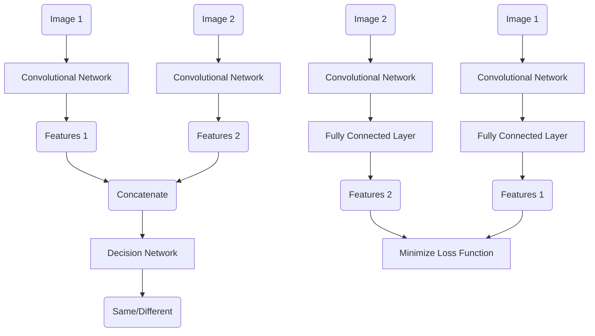
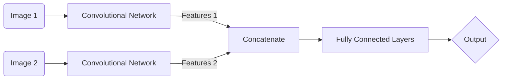
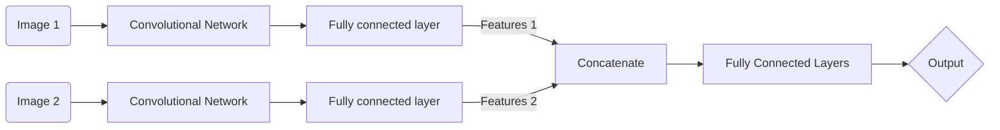
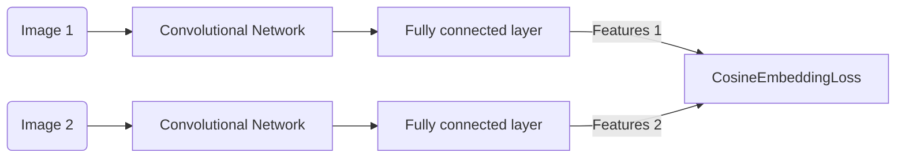
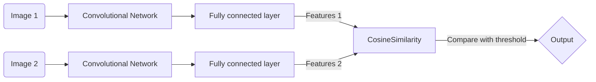

# Person Verification
## Main Goal
The task that the neural networks designed have to perform is: given two images state if they are from the same identity or not.

## Dataset
Celebrities in Frontal-Profile dataset has been used. The data set contains 10 frontal and 4 profile images of 500 individuals. Similar to LFW, it has 10 splits defined, each containing 350 same and 350 not-same pairs. This dataset is to be used for face verification.
As Sengupta et al. [^1] shows that many existing algorithms suffer a decrease over 10% from frontal-frontal to frontal-profile verification, cross-pose face recognition is still an extremely challenging scene.
[^1]: S. Sengupta, J.C. Cheng, C.D. Castillo, V.M. Patel, R. Chellappa and  D.W. Jacobs.  **[Frontal to Profile Face Verification in the Wild](http://www.cfpw.io/paper.pdf)**, IEEE Conference on Applications of Computer Vision, 2016.

## Implemented  Arquitecture
In order to perform the verification task each one of the images passes throught a Siamese Network that uses the same weights while working in tandem on the two different images. For the Siameses Networks we use the convolutional layers of a [network pretrained for image classification](https://pytorch.org/docs/stable/torchvision/models.html#classification). After concatenating the features extracted from the Siameses Networks, we explore two diferent strategies:
1. Use a Decision Netwok to classify the two images as belonging to the same or different identity.
2. Use a Loss Function that compresses intra-variance (same identity) and enlarges inter-variance (different identities).

We explore a slight variation of the first architecture, moving one of the fully connected layers to the Siamese's Networks to extract a more compact representation of the features.

### Architecture 1

#### Architecture 1, variation

### Architecture 2

#### Architecture 2 during testing or inference

## Experiments Performed
### Studied Parameters/Strategies
The following parameters/strategies have been studied in order to see its influence in the network and increase the accuracy:
1. Architectures described above
2. Learning rate
3. Use of the pre-trained weights of the Convolutional Network
4. Fine tune some of the weights of the Convolutional Network
5. Use of different Convolutional Networks
6. Data Augmentation
7. Loss Function

For the first architecture we have studied the influence of having a single neuron at the end of the network and using [Binary Cross Entropy Loss](https://pytorch.org/docs/stable/nn.html#torch.nn.BCELoss) or  having two neurons and optimizing the [Cross Entropy Loss](https://pytorch.org/docs/stable/nn.html#crossentropyloss).

For the second architecture we have used the [Cosine Embedding Loss](https://pytorch.org/docs/stable/nn.html#cosineembeddingloss). It's a cosine margin based loss that learn to discriminate face features in terms of angular similarity of the feature vectors.
 
### Results Obtained
We study the influence of data augmentation and the use or not of the pretrained weights at the convolutional network for Architecture 1 and Binary Cross Entropy Loss, see results bellow.
| Experiment ID | Loss | Features from | Learning Rate | Epochs | Pretrained |Data Augmentation | Validation Accuracy |Test Accuracy | Best Epoch |
|--------| :--------:| :--------:| :--------:| :--------:| :--------:|:--------:|:--------:|:--------:|:--------:|
| 01 | BCELoss | VGG16's Convolutionals | 1e-4 | 7 | Yes | Not | 0.711 | 0.735| 4
| 02 | BCELoss | VGG16's Convolutionals | 1e-4 | 7 | Not | Not | 0.506 | - | 1   
| 03 | BCELoss | VGG16's Convolutionals | 1e-4 | 7 | Yes | Yes | 0.709 | - | 6
| 04 | BCELoss | VGG16's Convolutionals | 1e-4 | 7 | Not | Yes | 0.501 | - | 7
| 05 | BCELoss | Linear layer | 1e-4 | 7 | Yes | Not | 0.714 | 0.718 | 3
| 06 | BCELoss | Linear layer | 1e-4 | 7 | Not | Not | 0.504 | 0.505 | 2   
| 07 | BCELoss | Linear layer | 1e-4 | 7 | Yes | Yes | 0.713 | 0.727 | 4
| 08 | BCELoss | Linear layer | 1e-4 | 7 | Not | Yes | 0.501 | 0.503 | 1
Better results are obtained when the training starts with the pretrained weights of the convolutional network.

We continue exploring the influence of data augmentation for Architecture 1 and Cross Entropy Loss, see results bellow.
| Experiment ID | Loss | Features from | Learning Rate | Epochs | Pretrained |Data Augmentation | Validation Accuracy |Test Accuracy | Best Epoch |
|--------| :--------:| :--------:| :--------:| :--------:| :--------:|:--------:|:--------:|:--------:|:--------:|
| 11 | CELoss | VGG16's Convolutionals | 1e-4 | 20 | Yes | Not | 0.793 | 0.782 | 11 
| 13 | CELoss | VGG16's Convolutionals | 1e-4 | 14 | Yes | Yes | 0.803 | 0.819 | 11   
| 15 | CELoss | Linear layer | 1e-4 | 20 | Yes | Not | 0.772 | 0.765 | 14
| 17 | CELoss | Linear layer | 1e-4 | 14 | Yes | Yes | 0.710 | 0.727 | 13
Data augmentation increases accuracy around 1-4% when the input features of the decision network are extracted from the convolutional layers of the VGG16 and the Cross Entropy Loss is used.

The following experiments have been performed with the Architecture 2:
| Experiment ID | Loss | Features from | Learning Rate | Epochs | Pretrained |Data Augmentation | Validation Accuracy |Test Accuracy | Best Epoch |
|--------| :--------:| :--------:| :--------:| :--------:| :--------:|:--------:|:--------:|:--------:|:--------:|
| 21 | CosineEmbeddingLoss | VGG16's Convolutionals | 1e-4 | 14 | Yes | Not | 0.807 | 0.826 | 9
| 21 | CosineEmbeddingLoss | VGG16's Convolutionals | 5e-4 | 14 | Yes | Not | 0.708 | 0.714 | 11
| 23 | CosineEmbeddingLoss | VGG16's Convolutionals | 1e-4 | 14 | Yes | Yes | 0.821 | 0.818 | 12    
| 23 | CosineEmbeddingLoss | VGG16's Convolutionals | 5e-4 | 14 | Yes | Yes | 0.709 | 0.720 | 14 
| 33 | CosineEmbeddingLoss | VGG16's Convolutionals Fine Tunning | 1e-4 | 14 | Yes | Yes | 0.746 | 0.749 | 13
Data augmentation increases accuracy around 2% when the input features of the decision network are extracted from the convolutional layers of the VGG16 and the Cosine Embedding Loss is used.
We try to fine tune only half of the layers of the VGG16 instead of training the whole network for Architecture 2. But, the fine tuning strategy doesn't get better results for the studied case.

We try different Convolutional Networks for Architecture 2, see table bellow.
| Experiment ID | Loss | Features from | Learning Rate | Epochs | Pretrained |Data Augmentation | Validation Accuracy |Test Accuracy | Best Epoch |
|--------| :--------:| :--------:| :--------:| :--------:| :--------:|:--------:|:--------:|:--------:|:--------:|
| 21 | CosineEmbeddingLoss | VGG16 | 1e-4 | 14 | Yes | Not | 0.807 | 0.826 | 9
| 43 | CosineEmbeddingLoss | ResNet50 | 1e-4 | 14 | Yes | Yes | 0.822 | 0.825 | 7
| 53 | CosineEmbeddingLoss | ResNet101 | 1e-4 | 14 | Yes | Yes | 0.823 | 0.831 | 14
| 63 | CosineEmbeddingLoss | ResNext50 | 1e-4 | 14 | Yes | Yes | 0.826 | 0.834 | 12
The 

We study the influence of the learning rate for Architecture 1 and Cross Entropy Loss, see results bellow.
| Experiment ID | Loss | Features from | Learning Rate |Optimizer| Epochs | Pretrained |Data Augmentation | Validation Accuracy |Test Accuracy | Best Epoch |
|--------| :--------:| :--------:| :--------:| :--------:| :--------:|:--------:|:--------:|:--------:|:--------:|:--------:|
| 13 | CELoss | VGG16's Convolutionals | 1e-4 | Adam | 20 | Yes | Yes | 0.718 | 0.730 | 20   
| 13 | CELoss | VGG16's Convolutionals | 1e-4 | SGD | 20 | Yes | Yes | 0.744 | 0.750 | 20 
| 13 | CELoss | VGG16's Convolutionals | 5e-4 | SGD | 20 | Yes | Yes | 0.825 | 0.824 | 16   
| 13 | CELoss | VGG16's Convolutionals | 1e-3 | SGD | 20 | Yes | Yes | 0.826 | 0.834 | 20  
When training the network with a learning rate of 5e-4 or 1e-3 we face some problems for convergence with the Adam Optimizer, so we try the SGD Optimizer (see results above).

We train both architectures during during more epochs, see results bellow.
| Experiment ID | Loss | Features from | Learning Rate | Optimizer | Epochs | Pretrained |Data Augmentation | Validation Accuracy |Test Accuracy | Best Epoch |
|--------| :--------:| :--------:| :--------:| :--------:| :--------:|:--------:|:--------:|:--------:|:--------:|:--------:|
| 13 | CELoss | VGG16's Convolutionals | 1e-4 | Adam | 40 | Yes | Yes | 0.827 | 0.832 | 39   
| 13 | CELoss | VGG16's Convolutionals | 1e-4 | SGD | 40 | Yes | Yes | 0.805 | 0.806 | 39
| 13executant a S | CELoss | VGG16's Convolutionals | 1e-3 | SGD | 40 | Yes | Yes |  |  | 
| 23 | CosineEmbeddingLoss | VGG16's Convolutionals | 1e-4 | Adam | 40 | Yes | Yes | 0.832 | 0.849 | 17
| 23 executant a S_E | CosineEmbeddingLoss | VGG16's Convolutionals | 1e-3 | SGD | 40 | Yes | Yes |  |  | 
| 63 | CosineEmbeddingLoss | ResNext50 | 1e-4 | 40 | Adam | Yes | Yes | 0.839 | 0.843 | 35
| 63 executant a B | CosineEmbeddingLoss | ResNext50 | 1e-3 | SGD | 40 | Yes | Yes |  |  | 
When training for a greater number of epochs we obtain a greater accuracy.

### Observed Behavior

### How to reproduce the experiments

## Conclusions

## TO DO
## Inspiration
Inheriting from the object classification network such as AlexNet, the initial Deepface and DeepID adopted cross-entropy based softmax loss for feature learning. After that, people realizad that the softmax loss is not sufficient by itself to learn feature with large margin, and more researchers began to explore discriminative loss functions for enhanced generalization ability. Before 2017, Euclidean-distance-based loss played an important role; in 2017, angular/cosine-margin-based loss as well as feature and weight normalization became popular. 
DeepFace
FaceNet

> Written with [StackEdit](https://stackedit.io/).
